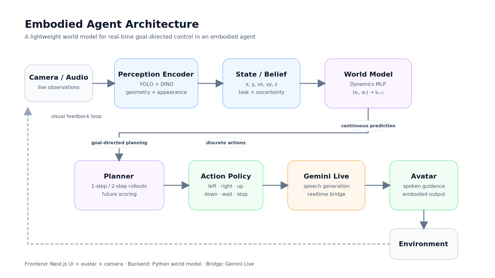
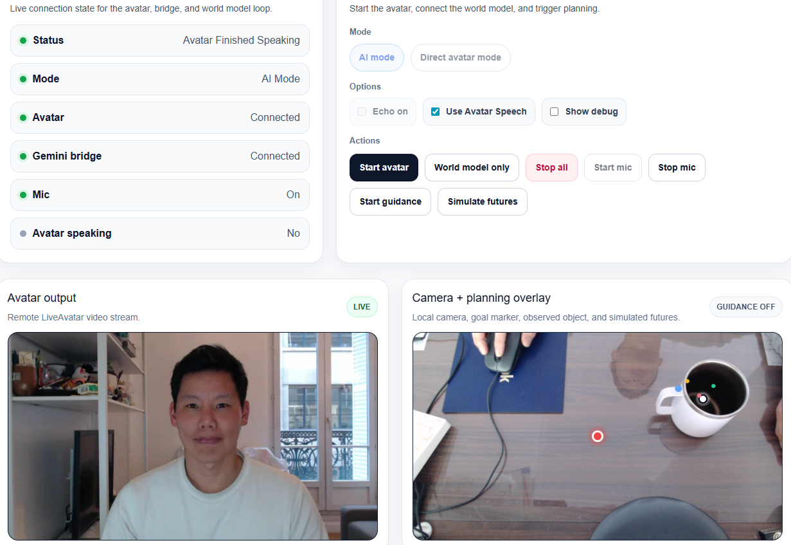

# 🧠 Embodied Agent

## A lightweight world model for real-time goal-directed control in an embodied agent

<p align="left">
  <a href="https://github.com/tonyt-ai/embodied-agent"></a>
  
  
  
</p>

> A minimal real-time agent that **sees**, **predicts**, **plans**, and **speaks**. It learns how the world evolves from its own observations and uses that knowledge to act.

---

# ✨ Abstract

This project implements a lightweight, explicit world model: a compact state representation combined with a learned action-conditioned dynamics model that predicts short-horizon futures and enables rollout-based planning. It does not attempt to learn representations end-to-end (e.g. JEPA-style), but instead builds on frozen perceptual features (DINOv2) and focuses on predictive dynamics and control.

Unlike reactive multimodal assistants, this system explicitly models counterfactual outcomes and maintains a persistent structured state over object locations and task context, acting as a lightweight belief over the environment. This enables reasoning under partial observability, informative action selection, and grounded explanations through language.

### ❌ What this is not

This is not:
* a fully learned latent world model (e.g. JEPA-style end-to-end training)
* a probabilistic belief-state model
* long-horizon planning or general environment simulation
* trained on large-scale video datasets

Instead, this is a **minimal, real-time, interpretable world model prototype** focused on action-conditioned prediction and control.
This demonstrates that even small systems can exhibit core properties of world models—prediction, counterfactual reasoning, and goal-directed control—without requiring large-scale training.

---

# 🔁 Core loop

This is the minimal closed-loop required for embodied intelligence:
```text
perception → state → prediction → planning → action → speech
```
The agent observes the world, compresses it into a state, predicts how it evolves under actions, plans using those predictions, acts, and communicates the result.
The core of the system follows a standard world model formulation:
```text
s_{t+1} = f(s_t, a_t)
```
where s_t is the current state (including geometric and visual features), and a_t is the chosen action.

---

# 🧩 System overview



---

# 🚀 What the system does

The system runs a **real-time embodied predictive control loop**, where behavior emerges from prediction and planning rather than reactive rules:

* observes the scene through a live camera (e.g., a cup on a desk)
* detects and tracks a target object (YOLO)
* builds a compact state (position, motion, appearance with DINOv2)
* predicts how the scene evolves under candidate actions
* simulates short future trajectories (2-step rollouts)
* selects the action (`left`, `right`, `up`, `down`, `wait`, `stop`) that best moves toward the goal (e.g., center of camera image)
* communicates the decision through a speaking avatar via **Gemini Live + LiveAvatar** as the object moves
* stops when the goal is reached

In practice, the agent behaves like a predictive assistant: it continuously forms hypotheses about the world, tests them through imagined futures, and acts on the most promising one.

---

# 🌐 Runtime & system integration

The system runs locally in a web browser as a real-time application. A Node.js server orchestrates communication between the frontend, the Python world model backend, and the avatar layer via WebSockets.
* The browser handles UI, camera input, and user interaction
* The Python backend performs perception, state update, prediction, and planning
* The Node.js bridge connects to Gemini Live and LiveAvatar for speech and avatar rendering

This enables a low-latency closed loop where perception, prediction, planning, and embodied feedback are continuously synchronized.

End-to-end flow:
```text
Browser (UI + camera)
        ⇄
Node.js (WebSocket orchestrator)
        ⇄
Python world model (perception + prediction + planning)
        ⇄
Gemini Live + LiveAvatar (speech + avatar)
```

Design choices prioritize:
* real-time performance
* simplicity and debuggability
* modularity (separating perception, dynamics, and planning)
rather than end-to-end training complexity.

---

# 🧠 Core idea

The system learns a predictive world model in state space instead of raw pixels. By simulating future states under candidate actions, it can choose actions based on predicted outcomes, not just current observations.

```text
f(s_t, a_t) → s_{t+1}
```

Planner:

```text
(s_t, a1) → s_{t+1}
(s_{t+1}, a2) → s_{t+2}
```

Selects and communicates the best first action.
This differs from reactive agents by explicitly predicting and evaluating future states before acting.

---

# 🏗️ Architecture

## Perception

Perception extracts both geometry (where) and appearance (what) to build a compact, learnable state:
* YOLO → object detection
* DINOv2 → appearance embedding

## State (world representation)

The state is a low-dimensional abstraction of the scene, combining position, motion, and appearance into a form suitable for prediction and planning:
```python
state = [x, y, vx, vy, z]
```
The model operates not only on geometric state (position, velocity) but also on learned visual representations from DINOv2, allowing the dynamics model to reason in a semantically meaningful feature space rather than raw pixels. This brings the system closer to latent world model approaches, while keeping the representation frozen for efficiency and simplicity.

## Dynamics

The dynamics model learns how the world evolves under actions, enabling counterfactual reasoning (“what happens if I do this?”):
* MLP transition model
* trained from self-collected transitions

## Planning

The planner evaluates multiple imagined futures and selects the action that maximizes expected progress toward the goal. Even short rollouts al enable non-trivial behavior.
At each step, the system simulates multiple candidate futures by rolling out the learned dynamics model under different actions, and selects actions by scoring these predicted trajectories relative to the goal:
* discrete action set
* 2-step rollout
* value-based selection
This enables counterfactual reasoning: evaluating “what would happen if I take action A vs B” before acting.

## Embodiment

The agent’s internal decision is exposed through speech and avatar, making its reasoning observable and interactive:
* action → Gemini Live → avatar speech

---

# 🖥️ Demo

https://youtu.be/xqM3ZvzW6Xk

Example of usage:
* AI mode + Use Avatar Speech
* Start avatar + Start mic: Gemini Live and LiveAvatar will start, the agent will appear (on the left).
* A live video stream of the scene is shown in real time (on the right): e.g., a cup on a desk.
* Talk to the Gemini Live agent ("Hello..."). We ready, say: "Start guidance!"
* The agent will provide guidance ("up", "down", etc.) as the object is moved towards the goal.
* When the goal is reached (e.g., cup at center of image), the agent says "stop".

---

# 📦 Repository structure

```text
embodied-agent/
│
├── app/                        # Next.js frontend (UI + avatar + camera)
│   ├── page.tsx
│   ├── layout.tsx
│   ├── globals.css
│
├── public/                     # Static assets (optional)
│
├── world_model/                # 🔥 Core backend (Python)
│   │
│   ├── server.py               # WebSocket server (YOLO + planning)
│   ├── world_state.py          # Object tracking + state vector
│   ├── planner.py              # 1-step / 2-step planning
│   ├── dynamics_model.py       # MLP transition model
│   ├── dino_encoder.py         # DINO embedding
│   ├── train_dynamics.py       # Training script
│   ├── clean_transitions.py    # Dataset filtering
│   │
│   ├── models/                 # trained + external models
│   │   ├── dynamics_model.pt
│   │   └── yolov8n.pt
│   │
│   ├── data/                   # collected dataset
│   │   ├── transitions.jsonl
│   │   └── transitions_clean.jsonl
│   │
│   └── __init__.py
│
├── server/                     # Node bridge (Gemini Live)
│   └── live-bridge.mjs
│
├── .env.local
├── .gitignore
│
├── package.json
├── package-lock.json
├── tsconfig.json
├── next.config.ts
├── postcss.config.mjs
├── eslint.config.mjs
│
├── requirements.txt
└── README.md
```

---

# ⚙️ Setup

```bash
pip install -r requirements.txt
npm install
```
### Start backend

```bash
python world_model/server.py
```

### Start Gemini bridge

```bash
$env:GEMINI_API_KEY="your_key" (WIN)   or   export GEMINI_API_KEY=your_key
node server/live-bridge.mjs
```

### Start frontend

```bash
npm run dev
```

### Open the app in your web browser

``` text
http://localhost:3000
```
If port 3000 is already in use, Next.js will display another URL (e.g., http://localhost:3001) in the terminal.

### Run the demo

In the browser:
* allow camera and microphone access
* click Start Avatar
* click Start Mic
* say: “start guidance”

The agent will:
* observe the scene (using latent states)
* predict future states
* plan actions
* speak guidance in real time

---

# 🔑 API Keys

This project requires access to Gemini API and LiveAvatar API for speech and avatar rendering.
Required services:
* Google Gemini API (speech + LLM): https://ai.google.dev/gemini-api/docs/live-api
* LiveAvatar API (real-time avatar rendering): https://www.liveavatar.com/

These APIs enable the embodied interface layer (speech + avatar). The world model itself runs independently.
You can store everything in a .env.local file placed in the root directory:
```bash
GEMINI_API_KEY=your_key
LIVEAVATAR_API_KEY=your_key
```
In addtion:
* Set the LiveAvatar  avatar_id  in app/api/liveavatar/session/route.ts
* Set the Gemini Live  voiceName  in server/live-bridge.mjs 

The configuration will be picked up automatically.

---

⚠️ Notes

These APIs are required for:
* real-time speech generation
* avatar animation

The world model backend can run independently, but the full embodied experience requires both APIs.

---

🧠 Tip

If you just want to test the world model you can bypass Gemini Live + LiveAvatar (see UI).

---

# 📊 Data collection & training

### Data collection

Training data is collected online from real observations, without manual labeling:
* the system observes object motion over time
* infers the effective action (e.g., left/right/up/down) from displacement
* constructs transitions:
```text
{
  "state": s_t,
  "action": a_t,
  "next_state": s_{t+1}
}
```
To capture data, run the backend with the --capture flag:
```bash
python server.py --capture
```
Then start "World model only" mode, with the camera pointing to the scene with the object (e.g., a cup) to move around.
This produces a dataset of self-collected trajectories directly aligned with the task. Data is saved in world_model/data/transitions.jsonl. The dataset can be further filtered using the clean_transitions.py script.

### Training

The model is trained on self-collected transitions (state, action, next_state), allowing it to learn directly from continuous real observations without manual labels.
After data collection, train the prediction model by running:
```bash
python world_model/train_dynamics.py
```

---
# ⚡ Performance

The system operates in real-time with low end-to-end latency.
Below are typical profiling measurements on a laptop GPU:
```bash
Capture:           ~3 ms
Server decode:     ~0.5 ms
Server detect:     ~8–10 ms
Server total:      ~9–12 ms
Pipeline latency:  ~10–15 ms
```
### Breakdown

* Capture: frame acquisition and encoding in the browser
* Server decode: base64 → image reconstruction
* Server detect: YOLO inference (dominant cost)
* Server total: full backend processing (detection + state update)
* Pipeline latency: end-to-end round-trip latency

### Observations
* The system runs at ~80–100 FPS equivalent latency
* YOLO inference dominates compute (~80%)
* DINO embeddings (when enabled sparsely) have negligible impact on latency
* The architecture supports real-time closed-loop control

---

# ⚠️ Limitations

These limitations are intentional and reflect the focus on minimality and clarity:
* short planning horizon (2-step) for simplicity and real-time performance
* single-object focus
* no long-term memory
* no learned reward
* dynamics sensitive to data

---

# 🔭 Next steps

Natural extensions toward more general embodied intelligence:
* longer-horizon planning
* richer latent state
* multi-object reasoning
* memory
* better predictive learning

---

# 💡 Key insight

> A small system can already combine perception, prediction, planning, and language into a real-time embodied loop.

---

# 📚 References

This project is inspired by recent work on predictive world models, representation learning, and embodied agents:

[1] Self-Supervised Learning with Joint-Embedding Predictive Architectures.
Y. LeCun, 2022

[2] Video Joint Embedding Predictive Architecture (V-JEPA).
Meta AI, 2023

[3] V-JEPA 2.
Meta AI, 2024

[4] Embodied AI Agents: Modeling the World.
P. Fung et al., Meta AI, 2025

[5] DreamerV3: Mastering Diverse Domains through World Models.
D. Hafner et al., 2023

[6] Mastering Atari, Go, Chess and Shogi by Planning with a Learned Model (MuZero).
J. Schrittwieser et al., 2020

---

# 📄 License

MIT

---

# 📌 Citation / sharing

* ⭐ star the repo
* share / discuss
* open issues

