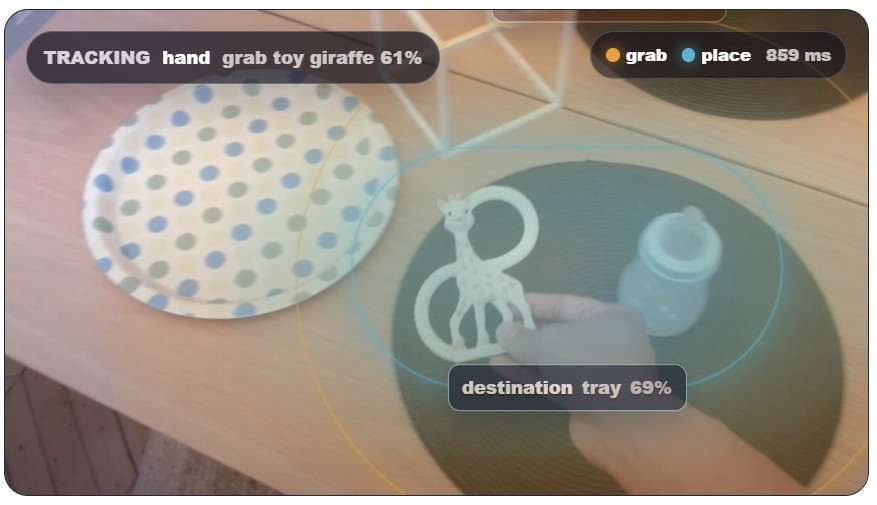

# Embodied Agent

A real-time, 3D-grounded world-model demo for egocentric assisted-living tasks.

The current showcase is the Sophie scene: a hand moves a baby bottle and Sophie the giraffe between a table mat and a tray. The system watches the scene from an egocentric video, builds a persistent 3D scene prior, tracks hands and objects online, predicts likely interaction futures, asks Gemini to refine weak object labels, and speaks timely guidance through a live avatar.

The focus is grounded interaction understanding:

```text
static SfM/COLMAP prior -> online SLAM/depth -> persistent objects/targets
              -> hand-object contact -> JEPA future prediction
              -> Gemini labels/speech -> UI heatmaps/avatar feedback
```



Current Sophie demo overlay showing a JEPA prediction cue: the hand is tracking Sophie the giraffe, the destination heatmap is on the tray, and the UI surfaces the predicted target before the full demo is polished.

## What The Demo Shows

- A static-scene bootstrap from the first part of the video.
- COLMAP sparse SfM prior plus online SLAM/depth grounding so mat, tray, hand, and objects live in one frame.
- YOLO/FastSAM regions plus V-JEPA2.1 embeddings for object tracking and re-identification across detector flicker.
- Gemini label refinement for objects that detectors label weakly or generically.
- Geometry-teacher contact and release detection from hand/object distance in 3D.
- An interaction-conditioned temporal head that predicts next contact, destination likelihood, object motion, and future latent state from recent hand-object-target state.
- UI attention heatmaps over likely grabbed objects and predicted destinations.
- Voice/avatar feedback aligned to hand detection, object grasp, and predicted placement.

Note on design principle: semantic names should come from the LLM/refinement path, while geometry remains the authority for physical contact. The learned temporal head is used as an anticipatory signal, not as a replacement for 3D evidence.

## Model Stack

Under the hood, the Sophie profile uses:

- YOLOv8 for light object detection and coarse detector labels.
- FastSAM-s for higher-recall segmentation regions in the Sophie demo profile.
- V-JEPA2.1 embeddings for object/hand appearance memory, object tracking, re-identification, and temporal prediction features.
- DINOv2 crop embeddings as a portability fallback and supporting baseline for tracking/re-ID.
- MediaPipe Hands for 2D hand landmarks, lifted into 3D with depth and camera geometry.
- Depth Anything monocular depth via Hugging Face Transformers when available, with a heuristic fallback if the model cannot load.
- COLMAP sparse SfM for the offline/static scene prior.
- Online sparse SLAM/PnP for camera motion and persistent map alignment during interaction.
- A PyTorch interaction-conditioned temporal head: a JEPA-like dynamics/prediction layer over grounded hand-object-target tokens, predicting contact, placement, motion, and future latent state.
- Gemini for semantic label refinement and assistant speech.
- LiveAvatar for embodied speech rendering when configured.

## LLM And Avatar Bridge

Gemini is used in two places:

- Label refinement: the perception stack sends object/target crops and lightweight context to Gemini when detector labels are weak or generic. Gemini can refine labels such as `baby bottle`, `Sophie the giraffe`, `mat`, or `tray`, but those names do not create physical state by themselves.
- Assistant speech: the UI and Node bridge use Gemini/LiveAvatar to speak concise, spatially grounded feedback such as first hand detection, likely grabbed object, and predicted destination.

The LLM is deliberately downstream of the world model. It translates and refines what the grounded system sees. Geometry, SLAM, depth, tracking, and contact logic provide the metric state and teacher signals; the learned temporal world model predicts how that grounded state is likely to evolve.

## Explicit And Latent State

This demo deliberately uses both explicit and latent structure:

- Explicit state: persistent 3D targets, object tracks, hand tracks, camera pose, contact/release events, and source/destination relations.
- Latent state: V-JEPA2.1 visual embeddings, temporal embedding memory, and the learned temporal head's future latent prediction. DINOv2 embeddings remain available as a fallback/baseline.

Persistence is meaningful here because targets and objects keep stable IDs and 3D anchors across frames, even when detector labels flicker or objects are temporarily weakly observed. That persistence is currently maintained by explicit geometry, tracking, and appearance memory; the learned temporal head predicts over those grounded tokens rather than replacing them.

This is a pragmatic world model rather than a pure latent-only model. The explicit 3D state makes the demo inspectable and physically grounded with commodity webcam input. The latent side is used where it helps most now: re-ID, temporal memory, contact/placement prediction, motion prediction, and future visual-state prediction.

The COLMAP sparse SfM prior exists because the sensing hardware is limited: a normal webcam does not provide calibrated metric depth or dense, reliable 3D on its own. A better sensor stack, such as RGB-D, stereo, or event/IMU-assisted capture, could relax the need for an offline prior. Today, COLMAP reconstruction is an offline preparation step; online SLAM and local mapping/refinement keep the live interaction running.

## Run

Install dependencies:

```bash
npm install
pip install -r requirements.txt
```

Set API keys if you want Gemini/voice/avatar support:

```bash
GEMINI_API_KEY=your_key
LIVEAVATAR_API_KEY=your_key
```

Run the Sophie demo:

```bash
npm run demo:sophie
```

Open:

```text
http://localhost:3000
```

The demo expects these local videos:

- `public/scene_sophie.mp4` for training.
- `public/scene_sophie_test.mp4` for held-out evaluation/playback.

Large videos, generated rows, COLMAP outputs, and model artifacts are ignored by Git. Keep them local, in Git LFS, or as release assets.

## Train And Evaluate JEPA

Train the Sophie interaction-conditioned temporal head:

```bash
npm run jepa:sophie:train
```

Evaluate on training rows:

```bash
npm run jepa:sophie:eval
```

Evaluate on the held-out test video:

```bash
npm run jepa:sophie:test
```

The shorter aliases still exist:

```bash
npm run jepa:train
npm run jepa:eval
npm run jepa:test
```

Those currently delegate to the Sophie commands above. `jepa:sophie:test` first builds rows from `public/scene_sophie_test.mp4` with `--no-train`, then evaluates the saved checkpoint. The eval report includes:

- `saved_model`: the real checkpoint score.
- `row_fit_upper_bound`: a sanity check trained and evaluated on the same rows. This only tells us whether the rows are learnable; it is not held-out performance.
- `contact_threshold_sweep` and `placement_threshold_sweep`: useful for choosing demo signal thresholds.

Current Sophie demo defaults use the temporal head as an early learned attention/prediction cue:

```text
TEMPORAL_HEAD_CONTACT_THRESHOLD=0.20
TEMPORAL_HEAD_PLACEMENT_THRESHOLD=0.45
```

Actual grasp/release still comes from geometry.

## How Far The World Model Goes

What is solid now:

- Persistent 3D state for static targets and movable objects.
- Online hand localization, hand trails, and hand-object proximity/contact.
- Object persistence across weak detector labels using geometry plus DINOv2 appearance embeddings.
- Learned interaction-conditioned prediction for contact, placement, motion, and future latent features.
- COLMAP sparse SfM prior plus online SLAM/depth for a physical world frame from commodity video.
- LLM bridge for label refinement and live speech/avatar feedback.
- Offline train/test evaluation for the temporal head and interaction pipeline.

What remains research-grade:

- More training captures are needed for stronger held-out temporal-head recall.
- The current model predicts short-horizon futures, not long multi-step plans.
- It is not yet a full JEPA-AC/action-conditioned planner because there is no explicit commanded action token; the conditioning comes from observed hand-object interaction state.
- Geometry is still the teacher; learned dynamics are not yet the sole source of physical truth.
- The LLM refines semantic labels but does not own the metric scene state.

Natural next steps:

- Capture more Sophie-scene train/test clips with varied lighting, hand speed, viewpoint, and object pose.
- Train on multiple clips and evaluate per-video generalization.
- Add class-weighted contact loss and sweep horizon/learning rate/thresholds.
- Decode future latent state into 3D object destination distributions.
- Add explicit action/control tokens to move from interaction-conditioned prediction toward a JEPA-AC action-conditioned world model.
- Move from one-step/short-horizon cues toward multi-step rollout over object/hand/target tokens.
- Run A/B tests for DINO, FastSAM/YOLO segmentation, depth scaling, and temporal head thresholds.
- Extend from observation/guidance to robot-task supervision: hand/object/target tokens become policy observations, and contact/release geometry becomes the teacher signal.

## Architecture

```text
Browser UI
  -> Node/Gemini bridge
  -> Python world model server
  -> detection, segmentation, depth, SLAM, 3D state
  -> hand/object contact, JEPA prediction, guidance
  -> overlays, heatmaps, speech, avatar
```

Core files:

- `app/page.tsx`: UI modes, overlays, heatmaps, timing, speech feedback.
- `server/live-bridge.mjs`: Gemini label/speech/avatar bridge.
- `world_model/server.py`: realtime perception and WebSocket backend.
- `world_model/world_state.py`: persistent 3D state, targets, hands, contact, prediction candidates.
- `world_model/hands.py`: MediaPipe hand tracking and 3D hand localization.
- `world_model/perception_candidates.py`: detector/segmenter candidate construction.
- `world_model/jepa_encoder.py`: V-JEPA2.1 visual features, with DINOv2 fallback for portability.
- `world_model/temporal_interaction_head.py`: interaction-conditioned contact/motion/placement/future-latent predictor.
- `world_model/train_temporal_heads.py`: train/test row generation and temporal-head training.
- `world_model/eval_temporal_head.py`: saved-model eval, row-fit upper bound, threshold sweeps.
- `world_model/validate_interactions.py`: offline interaction/contact validation.

## Useful Commands

```bash
npm run demo:sophie
npm run jepa:sophie:train
npm run jepa:sophie:eval
npm run jepa:sophie:test
python world_model/validate_interactions.py --video public/scene_sophie_test.mp4 --profile sophie
```

Detailed runtime switches live in [docs/runtime_knobs.md](docs/runtime_knobs.md). The normal demo path should stay simple.

## License

MIT
